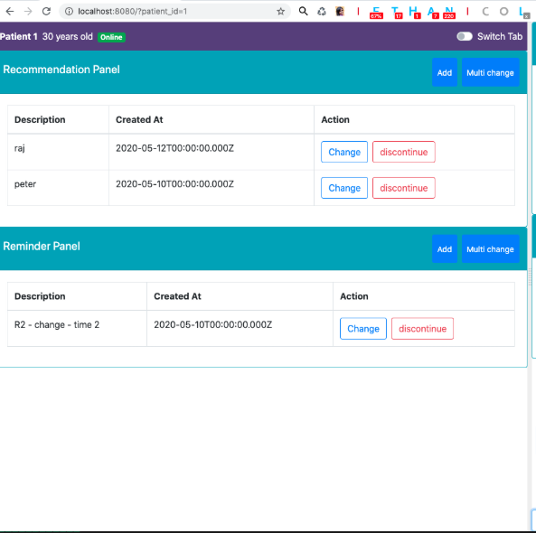
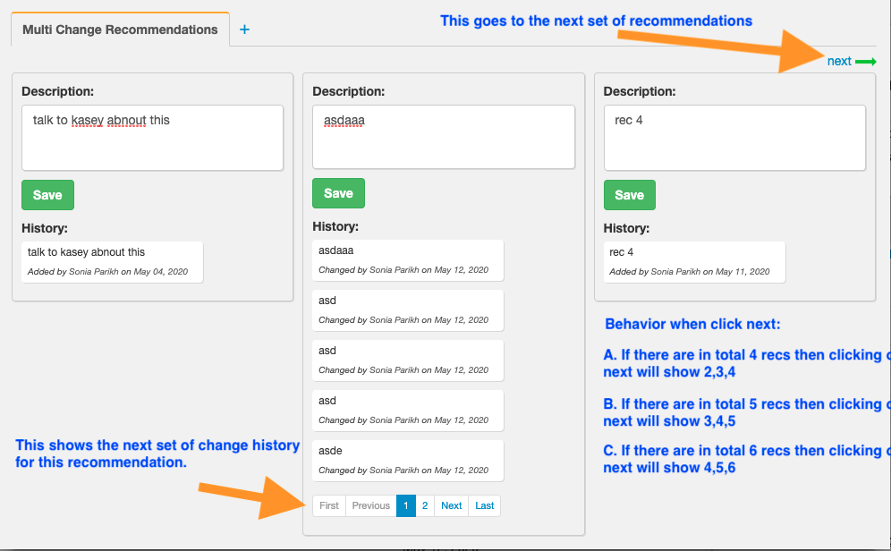

## Q1) Why patient app has left side and right side in layer 1?

Psychiatrist needs to be able to look at multiple historical states to make decisions and change the current state.

Left side shows the state of the :pt: on a particular date.

Right side is to change the current state of the :pt:.

The same componet is used on left and right hand side of layer 1. Just with different JSON data being returned from server

Left side is "Data as on time X"

Right side is "Data at current time"

## Q2) Why does the left side have two tabs on the top right corner in layer 1?

The 1st tab shows the health components and the 2nd tab shows the non-health components. There is a master table of components. And each component is either a health component or a "not-health" component.

## Q3) Why does the 2nd layer multi change tabs have prev and next?

## Q4) Why is prioritization important?

Most data like recommendations made to paient. Goals of the patient etc .. have a priority to them.

