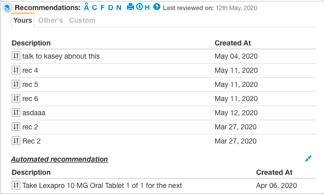

[[toc]]

## Q1) Why re-write the exisiting angular app?

1. The current angular app was developed to discover the psychiatrists needs. The system could not have been pre-architected to deliver the discovered features.

2. The current angular app is in 1.x and LTS ends in July 2021. Also good libraries are not being developed on Angular 1.x

## Q2) What benefits are being architected in this rewrite of the old app?

### A. User experience benefits

#### A1. Local storage

1. **Reload:** When page is reloaded and there is no/slow connection to DB server the page will load from localstorage immediately.

2. **Recall:** When a component is already on the doctor browser and the doctor gives the command "rec" then the recommendations show immediately from localcache and api is fired in the back. If the api returns new data the view is updated. (lazy-read)

3. **Write:** When doctor adds a rec, the view gets updated. If server update fails then the view is reverted. (lazy-write)

4. **Offline:** When doctor is offline and open a patient file they see the page. #not-working

#### A2. Responsive

1. **Number:** In each table column has priorities. So when less space is available low priority columns get hidden https://phppot.com/css/automatic-column-hiding-using-css-in-responsive-table

2. **Width:** When there is more space available the data columns instead of breaking the paragraph into 2 lines use 1 line.

3. **Choice:** User chooses which columns to display in browser. This setting is saved in localstorage. Each component has default selection and user can easily revert back to that.

### B. Tech Benefits from eco-system

1.  **Temporal DB**: No need to maintain [created and discontinued related fields](https://mariadb.com/kb/en/temporal-data-tables/). Each table 8 fields are replaced with 3 fields.

2.  **ORM**:

    Server side interaction with DB is through ORM [sequelize](https://sequelize.org/).

        1A. So standard queries are already written.

        1B. [DB versioning and migrations can happen.](https://github.com/savantcare/patientfile/blob/master/node-server/models/recommendation.model.js)

    Client side [vuex-orm](https://github.com/vuex-orm/vuex-orm)

3.  **elelemt.io** [Pre made components](https://element.eleme.io/#/en-US/component/layout)

4.  **Jest**

5.  **Application folder framework** Industry standard best practives. Decided to use [nuxt](https://nuxtjs.org/guide). This has built in integration with element.io and [vuex-orm](https://github.com/vuex-orm/vuex-orm-examples-nuxt)

6.  GraphQL: So only the required fields are fetched. [vuex-orm-graphql](https://github.com/vuex-orm/plugin-graphql)

### C. Tech Benefits from improved development practice

1. Maintain state on the client. When recommendation card state changes the rec panel changes its view automatically.
   In the current angular app the recommendation panel was listening on socket and then receiving HTML to update its view.

2. No HTML is generated on server. All view is inside the .vue component. This view works on json returned by the server api. This allows different UIs to be written.

3. **Slim DB**: Remove fields not needed and make component DB's consistent and clean.

4. **Review:** Code review before making it to master branch

5. **Open source:** Better code quality by developing it in open and make it open source from start.

6. **Documentation:** using vuepress and vue-stylegudist

### D. Other fields to explore:

1. Graphql
2. Form management
3. Any other nodejs library

## Q3) Why was vue chosen over angular latest version?

1. Simpler to understand

2. Useful libraries
   1. vuex
   2. Vue [form](https://github.com/vue-generators/vue-form-generator) [generator](https://blog.logrocket.com/how-to-build-reusable-forms-using-vue-form-generator/)
   3. [Persist state](https://github.com/robinvdvleuten/vuex-persistedstate)
   4. [Multi select](https://github.com/shentao/vue-multiselect)
   5. [KB Hotkey](https://dafrok.github.io/v-hotkey/#/step/4)
   6. [UI Library](https://github.com/ElemeFE/element)
      1. [Add and close tab good design](https://element.eleme.io/#/en-US/component/tabs#add-close-tab)
      2. [Inline form validation](https://element.eleme.io/#/en-US/component/form#validation)
      3. [Good looking form](https://element.eleme.io/#/en-US/component/form#basic-form)
      4. [History shown as timeline](https://element.eleme.io/#/en-US/component/timeline)
      5. [Card for right side](https://element.eleme.io/#/en-US/component/card)
      6. [Confirming actions does not take huge mouse movement](https://element.eleme.io/#/en-US/component/popconfirm)
      7. [Mouse over help looks good](https://element.eleme.io/#/en-US/component/popover#popover)
      8. [Doing multiple adds in same form](https://element.eleme.io/#/en-US/component/form#delete-or-add-form-items-dynamically)

Above advantages validated by, more github stars compared to angular or react. Stars are like voting from worldwide developers.

## Q4) Why was expressJS chosen over laravel?

Laravel: Used by 660 and Stars 59K

express nodejs: used by 6.6M and Stars 49K

Sequlize nodejs: Used by 190K and Stars 22K

## Q5) Should each component be in its own repo?

Current choice: Mono-repo https://en.wikipedia.org/wiki/Monorepo

Positives of mono-repo:

1. easier to refactor
2. new dev can get started without dependency hell.
3. No need to cooridate what version of node-server repo works with the current version of vue-client

Negatives of mono repo:

1. When recommendation a new version is released Sanjay wants to do git pull only for recommendation repo on the prod server.
   Counterpoint:
1. But the recommendation repo may depend on a specific version of the service side recommendation repo.
1. Service side rec repo may depend on a specific version of sequlize.
1. The dependency graph between rec UI repo and all the other repos is hard to maintain.

1. **Convention over configuration:** The multi repo design takes a lot of configuration. Without configuration, During work I need to update docs, node-server and vue-client all at once. When I do a git commit I want tests to get fired and run. When multiple repo the edits take more time. The test running becomes more complicated.

Hence branching is a better idea.

### Q5.1) Why not try branching concept?

Sometimes we need to invite external developers to work on a component and we do not want to give them access to the git repo containing other components. Counter point -> Protecting source code is not the first priority.

### Q5.2) Why is each component not a seperate npm package?

The goal is for recommendation-panel and recommendation-card to have the same vuex store. So when the state changes in recommendation-panel the view of recommendation-card is automatically updated.

[The code till 4th May](https://github.com/vikaskedia/patientfile) implemented recommendation-panel and recommendation-card as two different npm packages. Different npm packages cannot share the same vuex store.

Hence recommendation-panel and recommendation-card cannot be two seperate npm packages they have to be components of the same vue app.

### Future research

How to keep these files in a seperate repo. How to run them independently. Possible solution: https://github.com/teambit/bit

## Q6) Should a table library be used or developed internally?

Features needed:

1. KB to go up and down the data rows
2. Multi select using only KB or mouse.
3. Actions for each data row invoked using keyboard single key.
4. When multiple rows are selected then invoke "Multi select actions"
5. Tabbed tables -> First tab shows table 1 and 2nd tab shows table 2. Used at "Your recommendations" "Others recommendations"

For the tabs each tab can be a table component. And the tabs are displayed using Vue’s component element with the is special attribute:
https://vuejs.org/v2/guide/components.html#Dynamic-Components

6. Drag to reorder rows

## Q7) Why use an auto doc generator?

Decided not to use storybook since want something where the code is auto parsed.

So for vue client side code decided to use [vue-styleguidist](https://github.com/vue-styleguidist/vue-styleguidist)
Ref: https://www.youtube.com/watch?v=ryyAiUYvfY8

Click here for [steps to run the doc generator](/tech/howto.html#q1-how-to-start-the-documentation-system)
