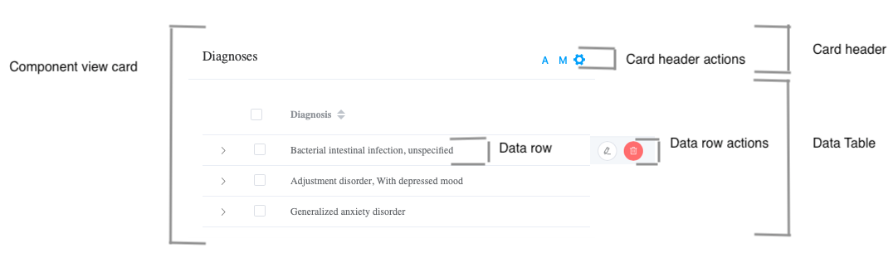
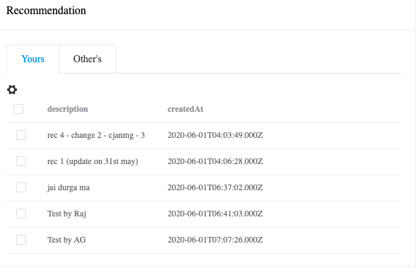
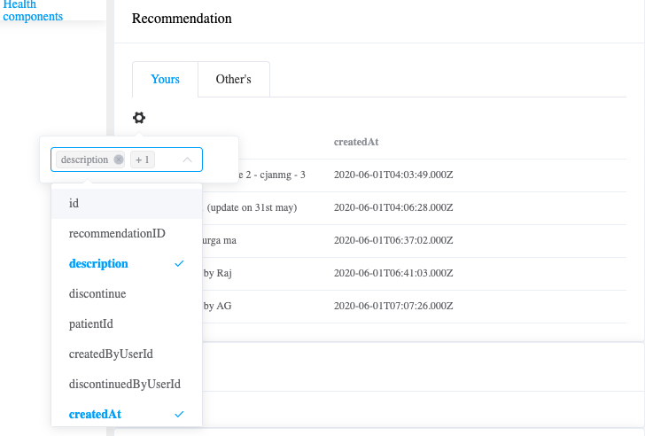

## Q1) What is the UI pattern for the patient app?

## Q2) What does the UI of a component in layer 1 look like?

Most cards have a data table inside them. But some cards can also have a graph or an image inside them.

## Q3) What does the EMR customizer look like?

## Q4) What columns are displayed in component card in layer 1?

Each component will come with a default set of columns that are displayed. The user can choose a different set of columns. The columns chosen by the user are saved on the client local storage. Once the chose is made for 1 paitent file that choice of columns is remembered for all patient files.

### Default set of columns

### User can choose a different set

