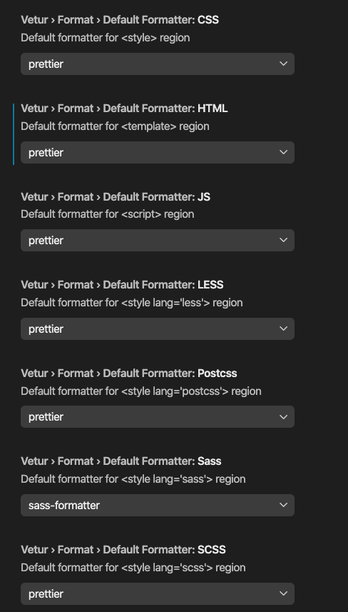

# How

## Q) How to start all dev servers?

```bash
> pwd
/Users/vk-tech/gt/sc-prog-repos/ptfile
> ./start-dev-servers-in-tmux.sh
```

## Q) How was documentation system installed?

```bash
yarn init

yarn add -D vuepress

echo '# Hello VuePress' > README.md

yarn docs:dev
```

## Q) How to install tmuxinator?

On mac -> brew install tmuxinator
on ubuntu -> apt install tmuxinator

## Q) What are the vs code settings?

auto format on save
default formatter: prettier



# Why

## Q) Why is vue-press in parent folder of ptclient and ptserver?

vuepress cannot refer to files in parent folders. This vuepress will be used to document both client and server.
